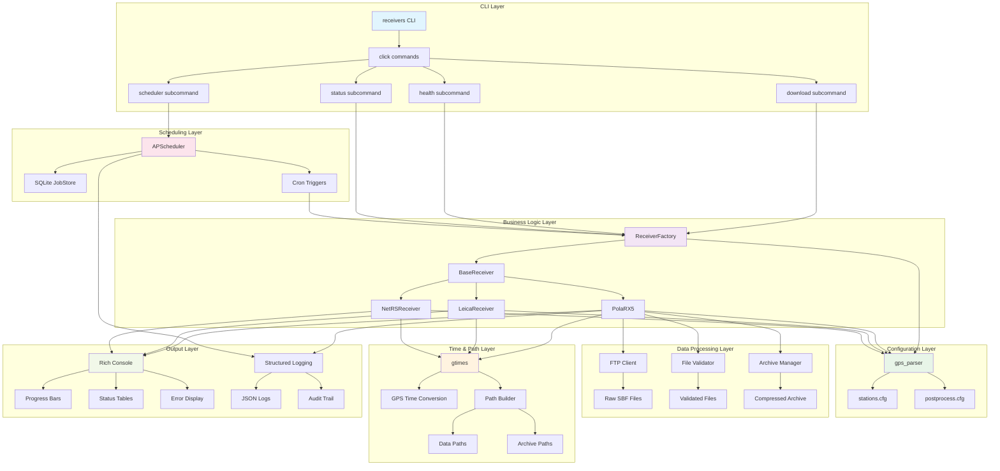
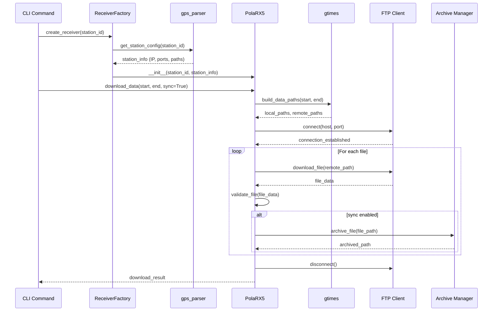
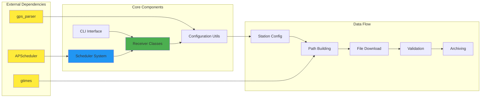
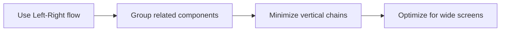

# Development Rules - GPS Receivers Package

**Version**: 1.0
**Last Updated**: 2025-09-22
**Status**: Living Document - Updated per session

This document establishes persistent development rules that apply across all Claude sessions and human developers working on the receivers package.

## 🏗️ Code Structure Rules

### Package Organization
```
receivers/
├── src/receivers/           # Source code (installable package)
│   ├── __init__.py         # Package exports
│   ├── cli/                # Command-line interface
│   ├── base/               # Abstract base classes
│   ├── septentrio/         # Septentrio-specific implementations
│   ├── leica/              # Leica receiver implementations
│   └── utils/              # Shared utilities
├── tests/                  # Test suite (mirrors src structure)
├── docs/                   # Documentation
│   ├── diagrams/           # Mermaid architecture diagrams
│   ├── development/        # Development guides
│   ├── examples/           # Sample scripts and data
│   └── legacy/             # Deprecated code (reference only)
├── CLAUDE.md               # AI assistant instructions
├── DEVELOPMENT_RULES.md    # This file
└── pyproject.toml          # Package configuration
```

### Module Naming Conventions
- **snake_case** for all Python files and directories
- **PascalCase** for class names
- **UPPER_CASE** for constants
- **lowercase** for package/module names

### Import Organization
```python
# Standard library imports
import os
from pathlib import Path
from typing import Dict, List, Optional

# Third-party imports
from rich.console import Console
import click

# Local package imports
from receivers.base import BaseReceiver
from receivers.utils.config import get_station_config
```

## 🔧 Code Quality Standards

### Type Hints (Required)
```python
def download_data(
    self,
    start: str,
    end: str,
    sync: bool = True
) -> Dict[str, Any]:
    """Download data with type safety."""
    pass
```

### Error Handling (Required)
```python
try:
    result = receiver.download_data(start, end)
except ConnectionError as e:
    logger.error(f"Connection failed for {station}: {e}")
    return {"status": "failed", "error": str(e)}
except Exception as e:
    logger.error(f"Unexpected error: {e}")
    raise
```

### Documentation (Required)
```python
def get_health_status(self) -> Dict[str, Any]:
    """Get comprehensive receiver health status.

    Returns:
        Dict containing:
        - overall_status: str ("healthy" | "degraded" | "failed")
        - voltage: float (in volts)
        - disk_usage: float (percentage)
        - connection_status: bool

    Raises:
        ConnectionError: If receiver unreachable
        TimeoutError: If health check times out
    """
```

## 🔄 Git Workflow Rules

### Branch Strategy
- **main**: Production-ready code only
- **feature/description**: New features (`feature/scheduler-improvements`)
- **fix/description**: Bug fixes (`fix/connection-timeout`)
- **refactor/description**: Code restructuring (`refactor/config-management`)

### Commit Message Format
```
type(scope): description

- feat(cli): add scheduler status command
- fix(septentrio): handle connection timeout gracefully
- refactor(config): consolidate station configuration logic
- docs(readme): update installation instructions
- test(download): add integration tests for bulk download
```

### Commit Rules
1. **One logical change per commit**
2. **Test before committing** (run linting/tests)
3. **Descriptive messages** (explain why, not what)
4. **No direct commits to main** (use feature branches)

### Pre-Commit Checklist
```bash
# REQUIRED before any commit
ruff check src/ tests/                    # Linting
mypy src/receivers/                       # Type checking
pytest tests/ -v                         # Test suite
receivers download TEST --test-connection # Integration test
```

## 🧪 Testing Requirements

### Test Organization
```
tests/
├── unit/                   # Unit tests (fast, isolated)
├── integration/            # Integration tests (real connections)
├── fixtures/               # Test data and mocks
└── conftest.py            # Pytest configuration
```

### Test Coverage Rules
- **Minimum 80% coverage** for new code
- **All public methods** must have tests
- **Error paths** must be tested
- **Integration tests** for CLI commands

### Test Naming
```python
class TestPolaRX5Download:
    def test_download_success_with_sync(self):
        """Test successful download with sync enabled."""

    def test_download_fails_on_connection_error(self):
        """Test proper error handling on connection failure."""

    def test_download_resumes_partial_files(self):
        """Test that partial downloads resume correctly."""
```

## 📦 Dependency Management

### Core Dependencies (Locked)
```toml
# Required - never remove
gtimes = ">=0.4.0"           # GPS time handling
gps_parser = {path = "../gps_parser"}  # Station configuration
rich = ">=13.0.0"            # Console output
click = ">=8.0.0"            # CLI framework
```

### Optional Dependencies
```toml
# Scheduler functionality
apscheduler = {version = ">=3.10.0", optional = true}
sqlalchemy = {version = ">=2.0.0", optional = true}

# Development
pytest = {version = ">=7.0.0", optional = true}
ruff = {version = ">=0.1.0", optional = true}
mypy = {version = ">=1.0.0", optional = true}
```

### Dependency Rules
1. **Pin major versions** (`>=X.Y.0`)
2. **Document why** each dependency is needed
3. **Keep minimal** - avoid dependency bloat
4. **Test compatibility** before upgrading

## 🚀 Development Workflow

### Session Start Checklist
1. **Read CLAUDE.md** for context
2. **Check git status** and recent commits
3. **Review TODO items** if any
4. **Run tests** to ensure clean starting state

### Feature Development Process
1. **Create feature branch** from main
2. **Write tests first** (TDD approach)
3. **Implement feature** with type hints
4. **Update documentation** if needed
5. **Run full test suite**
6. **Create descriptive commit**

### Code Review Standards
- **Self-review first** (read your own diff)
- **Check test coverage** (new code must be tested)
- **Verify documentation** (public APIs documented)
- **Run integration tests** (CLI commands work)

## 🎯 Architecture Principles

### SOLID Principles
- **Single Responsibility**: Each class has one reason to change
- **Open/Closed**: Open for extension, closed for modification
- **Liskov Substitution**: Subclasses work anywhere parent does
- **Interface Segregation**: Small, focused interfaces
- **Dependency Inversion**: Depend on abstractions, not concretions

### Receivers-Specific Rules
1. **Abstract base classes** for all receiver types
2. **Configuration via gps_parser** (no hardcoded values)
3. **gtimes integration** for all path/time operations
4. **Rich console output** for user-facing commands
5. **Structured logging** for production systems

### Error Handling Strategy
```python
# Production systems need graceful degradation
try:
    result = risky_operation()
except SpecificError as e:
    logger.warning(f"Expected error: {e}")
    return fallback_result()
except Exception as e:
    logger.error(f"Unexpected error: {e}")
    # Re-raise for development, return error dict for production
    if config.development_mode:
        raise
    return {"status": "error", "message": str(e)}
```

## 📋 Session Handoff Protocol

### Information to Preserve
1. **Current work state** (what was being implemented)
2. **Outstanding issues** (bugs, TODOs, blockers)
3. **Architecture decisions** (why choices were made)
4. **Test status** (what passes/fails)

### Context Documentation
```python
# Always add context comments for complex logic
def complex_function():
    """
    CONTEXT: This handles the edge case where Septentrio receivers
    return partial data during network interruptions. See issue #123.

    DECISION: We chose to retry with exponential backoff rather than
    fail immediately to improve reliability in remote locations.
    """
```

## 🔒 Security & Production Rules

### Configuration Security
- **No secrets in code** (use environment variables)
- **No hardcoded IPs** (use configuration files)
- **Validate all inputs** (especially from CLI)
- **Log security events** (connection attempts, failures)

### Production Readiness
- **Graceful error handling** (no crashes)
- **Resource cleanup** (close connections, files)
- **Progress indicators** (for long operations)
- **Structured logging** (JSON for automated parsing)

---

## 🚨 Breaking These Rules

If you need to break these rules:

1. **Document why** in commit message
2. **Add TODO** for future compliance
3. **Update this file** if rule needs changing
4. **Discuss in next session** if major change

## 🏛️ Architecture Overview

### Code Architecture Diagram



### Data Flow Architecture



### Component Interaction



## 📊 Diagram Maintenance Process

### Diagram Organization

```
receivers/
├── RECEIVER_ARCHITECTURE.md      # Root level - active development
├── DOWNLOAD_FLOW.md              # Root level - active development
├── tmp/
│   └── docs/
│       └── diagrams/             # Temporary mermaid-multi outputs
├── docs/
│   └── diagrams/                 # Official exported diagrams (PDFs, PNGs)
│       ├── DOWNLOAD_FLOW_DIAGRAM.md  # Legacy reference
│       └── *.pdf, *.png          # Generated diagram files
└── (future when stable)
    └── docs/
        └── architecture/         # Final home for architecture docs
```

**Rationale**:
- **Root level**: Architecture files highly visible during active development
- **tmp/docs/diagrams/**: Working directory for mermaid-multi tool
- **docs/diagrams/**: Official, permanent diagram exports
- **Future migration**: Move .md files to docs/architecture/ when architecture stabilizes

### Diagram Standards

**Format Requirements**:
- **Landscape orientation**: All diagrams must use `LR` (Left-Right) or horizontal flow
- **Mermaid syntax**: Use latest Mermaid features for clarity
- **Modular design**: Separate complex diagrams into focused, single-purpose diagrams
- **Consistent styling**: Use standardized colors and styling across diagrams

**Landscape Layout Guidelines**:


### When to Update Diagrams

**Mandatory Updates**:
1. **Architecture changes**: When adding/removing base classes, factories, or major components
2. **Flow modifications**: When changing download logic, error handling, or process flows
3. **New receiver types**: When adding support for new receiver manufacturers
4. **API changes**: When modifying public interfaces or configuration structure

**Update Process**:
1. **Before coding**: Update diagrams during planning phase
2. **During development**: Adjust diagrams as implementation evolves
3. **After completion**: Final diagram review and cleanup
4. **Code review**: Include diagram updates in pull request reviews

### Diagram Maintenance Rules

**Session Handoff**:
- **Document diagram changes** in commit messages
- **Reference specific diagrams** affected by code changes
- **Include diagram status** in session summaries

**Consistency Checks**:
- **Cross-reference** diagrams with actual code structure
- **Validate flow accuracy** against implementation
- **Update styling** to match current conventions
- **Test rendering** with mermaid-multi tool

### Automation and Tools

**Local Workflow**:
```bash
# View diagrams during development (auto-detects tmp/docs/diagrams)
mermaid-multi RECEIVER_ARCHITECTURE.md
mermaid-multi DOWNLOAD_FLOW.md

# Generate high-quality exports to docs/diagrams
mmdc -i RECEIVER_ARCHITECTURE.md -o docs/diagrams/receiver_architecture.png -s 3
mmdc -i DOWNLOAD_FLOW.md -o docs/diagrams/download_flow.png -s 3

# Preview inline with Neovim
# (Cursor on ``` triggers snacks.nvim preview)

# Working files are in tmp/docs/diagrams for easy cleanup
ls tmp/docs/diagrams/
```

**Quality Assurance**:
- **Spell check** diagram labels and descriptions
- **Validate Mermaid syntax** before committing
- **Check landscape layout** - avoid tall vertical diagrams
- **Verify color consistency** across related diagrams

### Diagram Types and Purpose

**Architecture Diagrams** (`receiver_architecture.md`):
- Class hierarchies and relationships
- Component dependencies
- Factory patterns and abstractions
- **Update when**: Adding receivers, changing base classes, modifying factory logic

**Flow Diagrams** (`download_flow.md`):
- Process flows and decision trees
- Error handling paths
- Performance optimization flows
- **Update when**: Changing download logic, adding error handling, modifying timeouts

**Sequence Diagrams**:
- Interaction between components over time
- API call sequences
- Configuration loading processes
- **Update when**: Changing component interactions, API modifications

### Common Maintenance Tasks

**1. Adding New Receiver Type**:
```bash
# Update architecture diagram (root level for easy access)
vim RECEIVER_ARCHITECTURE.md
# Add new receiver class to class hierarchy
# Add new download manager to implementations
# Update factory pattern diagram

# Test diagram rendering (outputs to tmp/docs/diagrams/)
mermaid-multi RECEIVER_ARCHITECTURE.md

# Generate official export
mmdc -i RECEIVER_ARCHITECTURE.md -o docs/diagrams/receiver_architecture.pdf
```

**2. Modifying Download Flow**:
```bash
# Update flow diagrams (root level for visibility)
vim DOWNLOAD_FLOW.md
# Modify affected process flows
# Update error handling paths if needed
# Adjust performance optimization flows

# Validate changes
mermaid-multi DOWNLOAD_FLOW.md

# Generate official export
mmdc -i DOWNLOAD_FLOW.md -o docs/diagrams/download_flow.pdf
```

**3. Deprecating Legacy Components**:
```bash
# Mark legacy components
# Add deprecation warnings to diagrams
# Reference new replacement components
# Update migration paths
```

### Integration with Development Workflow

**Planning Phase**:
- Review current diagrams before implementing changes
- Identify which diagrams need updates
- Plan diagram changes alongside code changes

**Implementation Phase**:
- Update diagrams incrementally as code evolves
- Use diagrams to validate implementation decisions
- Keep diagrams synchronized with code changes

**Review Phase**:
- Include diagram updates in code reviews
- Verify diagram accuracy against implementation
- Check for consistency with development rules

**Documentation Phase**:
- Export final diagrams for documentation
- Update README files with diagram references
- Archive outdated diagrams with migration notes

---

**Remember**: These rules exist to maintain code quality and enable smooth collaboration across sessions and developers. Diagrams are living documentation that must evolve with the codebase.