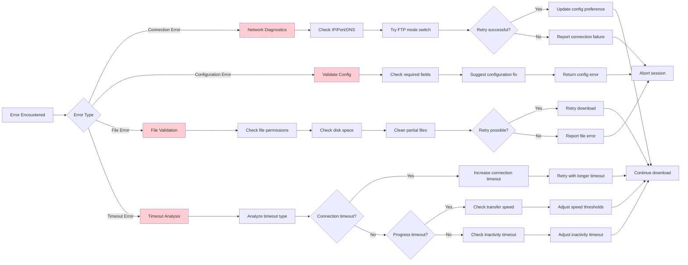
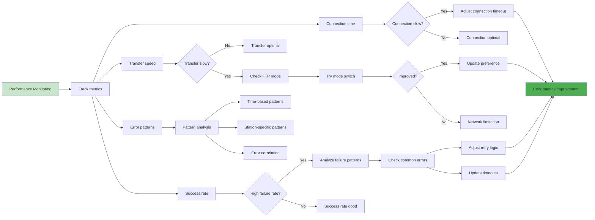

# Download Flow Architecture

This document shows the detailed download flow using the modular receiver architecture.

## High-Level Download Flow

```mermaid
flowchart LR
    A[CLI: receivers download STATION] --> B{Parse Arguments}
    B --> C[Load Station Config]
    C --> D[ReceiverFactory.create_receiver]

    D --> E{Receiver Type}
    E -->|PolaRX5| F[Create PolaRX5 + SeptentrioDownloadManager]
    E -->|NetRS| G[Create NetRS + TrimbleDownloadManager]
    E -->|Other| H[Create Receiver + DownloadManager]

    F --> I[Call receiver.download_data]
    G --> I
    H --> I

    I --> J[DownloadManager.download_session]
    J --> K[Process Time Parameters]
    K --> L[Generate File List using gtimes]
    L --> M[Identify Missing Files]

    M --> N{Missing Files?}
    N -->|No| O[Return: up_to_date]
    N -->|Yes| P{Sync Enabled?}

    P -->|No| Q[Return: dry_run]
    P -->|Yes| R[Establish Connection]

    R --> S[Download Missing Files]
    S --> T[Archive Files]
    T --> U[Close Connection]
    U --> V[Return: completed]

    style D fill:#e1f5fe
    style F fill:#f3e5f5
    style J fill:#e8f5e8
    style S fill:#fff3e0
```

## Detailed Download Session Flow

```mermaid
flowchart LR
    subgraph Setup["Setup Phase"]
        A[download_session called] --> B[Setup temp directory]
        B --> C[Process time parameters]
        C --> D[Generate datetime list]
    end

    subgraph FileGen["File Generation"]
        D --> E{Session Type}
        E -->|Hourly| F[Generate hourly timestamps]
        E -->|Daily| G[Use gtimes.datepathlist]
        F --> H[Create file dictionary]
        G --> H
        H --> I[Map datetime → paths]
    end

    subgraph Analysis["File Analysis"]
        I --> J[Check existing files]
        J --> K[Identify missing files]
        K --> L{Any missing?}
        L -->|No| M[Return up_to_date]
        L -->|Yes| N{Sync enabled?}
        N -->|No| O[Test connection only]
        N -->|Yes| P[Establish FTP connection]
        O --> Q[Return dry_run]
    end

    subgraph Download["Download Loop"]
        P --> R[For each missing file]
        R --> S[Get remote file path]
        S --> T[Check file exists on remote]
        T --> U{File exists?}
        U -->|No| V[Log file missing]
        U -->|Yes| W[Check local partial]
        W --> X{Resume?}
        X -->|Yes| Y[Calculate offset]
        X -->|No| Z[Start fresh]
        Y --> AA[Download with progress]
        Z --> AA
        AA --> BB[Validate download]
    end

    subgraph Archive["Archive Phase"]
        BB --> CC{Complete?}
        CC -->|No| DD[Keep partial]
        CC -->|Yes| EE{Immediate archive?}
        EE -->|Yes| FF[Archive immediately]
        EE -->|No| GG[Add to queue]
        FF --> HH[Continue to next]
        GG --> HH
        DD --> HH
        V --> HH
        HH --> II{More files?}
        II -->|Yes| R
        II -->|No| JJ[Close connection]
        JJ --> KK{Batch archive?}
        KK -->|Yes| LL[Archive all]
        KK -->|No| MM[Return results]
        LL --> MM
    end

    style P fill:#e1f5fe
    style AA fill:#f3e5f5
    style FF fill:#e8f5e8
```

## Error Handling Flow

## Performance Optimization Flow

## Key Features

1. **Modular Design**: Clear separation between receiver types and download logic
2. **Error Recovery**: Comprehensive error handling with automatic retries
3. **Performance Optimization**: Adaptive timeouts and connection mode switching
4. **Progress Tracking**: Real-time progress bars and detailed logging
5. **Fault Tolerance**: Immediate archiving and resume capability
6. **Configuration Driven**: All timeouts and settings from centralized config