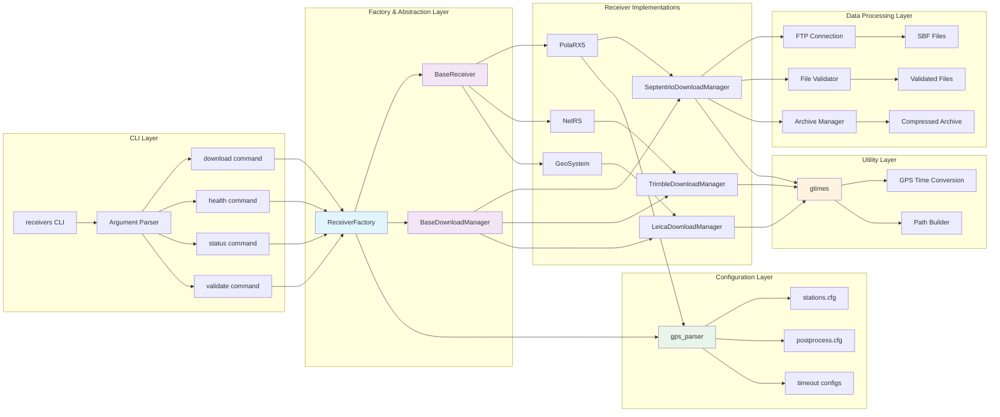
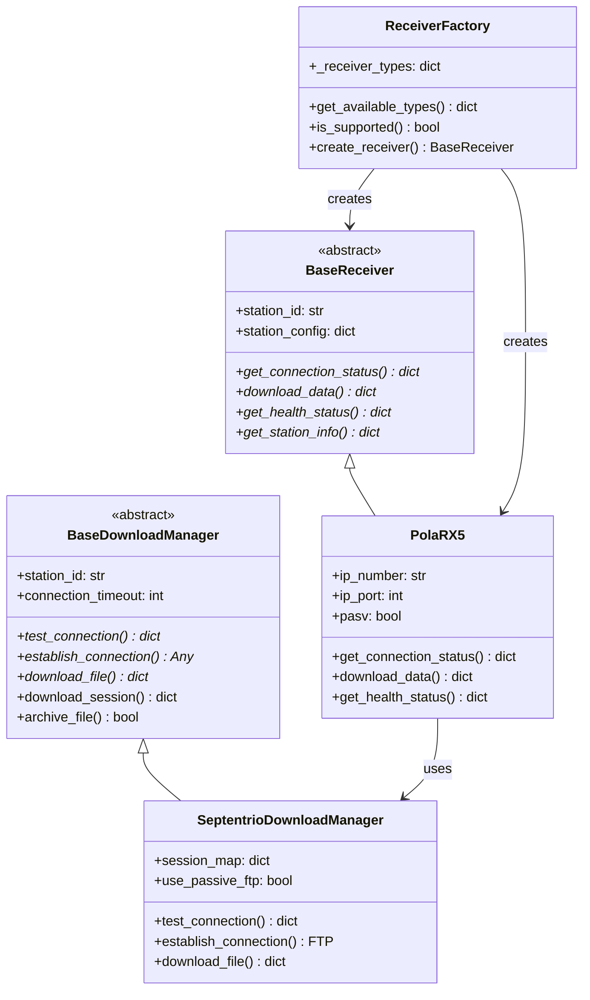
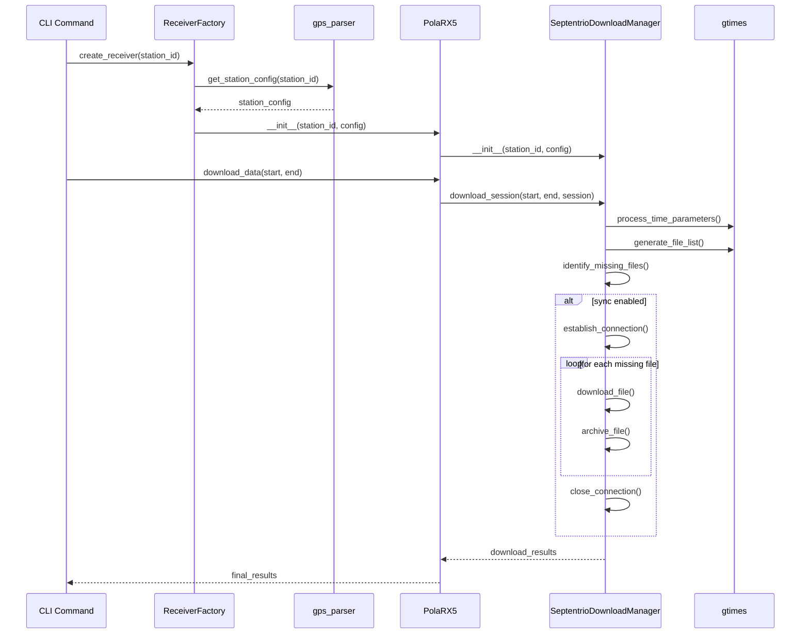
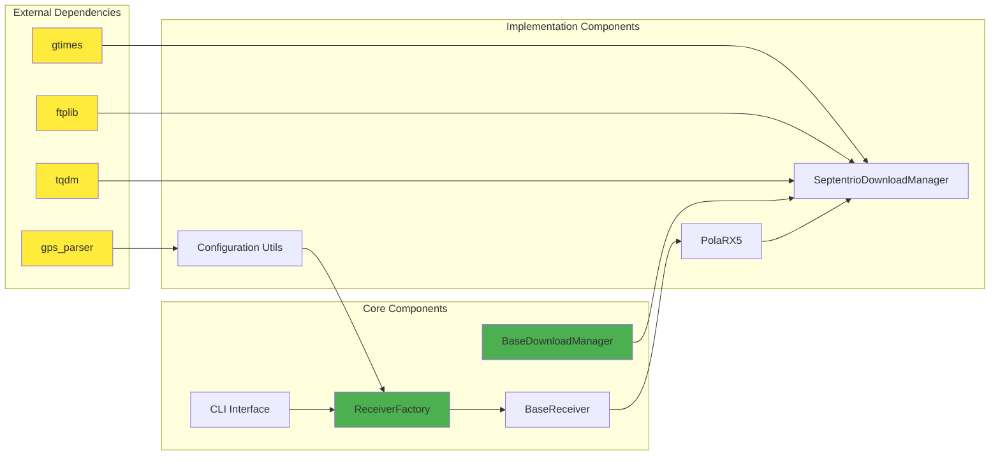

# Receiver Architecture Diagrams

This document contains the core architecture diagrams for the receivers package, showing the modular design with proper abstractions.

## Core Architecture Overview

## Class Hierarchy

## Data Flow Sequence

## Component Dependencies

## Key Design Principles

1. **Factory Pattern**: `ReceiverFactory` centralizes receiver creation and type discovery
2. **Strategy Pattern**: `BaseDownloadManager` provides common logic with receiver-specific implementations
3. **Separation of Concerns**: Clear separation between receiver logic and download logic
4. **Configuration Abstraction**: Centralized configuration through `gps_parser` integration
5. **Modular Architecture**: Each receiver type can have its own download manager implementation

## Extension Points

- **New Receiver Types**: Implement `BaseReceiver` and corresponding `BaseDownloadManager`
- **New Protocols**: Extend `BaseDownloadManager` for HTTP, SFTP, etc.
- **New Configurations**: Add receiver-specific configuration via `gps_parser`
- **New Features**: Add health monitoring, scheduling, etc. through base classes