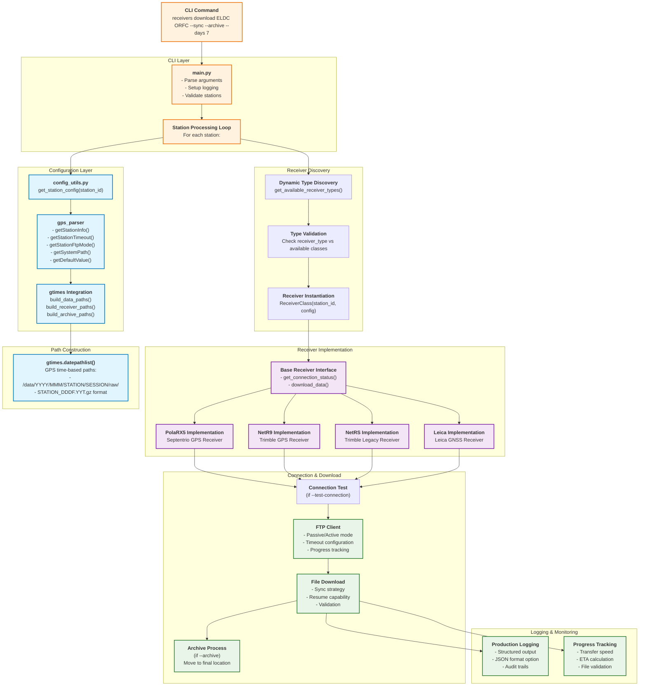

# Legacy Download Flow Diagram

**⚠️ This diagram is deprecated and being replaced by modular diagrams**

## New Architecture Documentation

**Active Development Files** (Root Level):
- [RECEIVER_ARCHITECTURE.md](../../RECEIVER_ARCHITECTURE.md) - Core architecture with factory pattern
- [DOWNLOAD_FLOW.md](../../DOWNLOAD_FLOW.md) - Detailed download flows

**Official Diagrams** (Generated):
- Check `docs/diagrams/` for exported PDFs and PNGs

**Temporary Outputs**:
- `tmp/docs/diagrams/` - mermaid-multi working directory

## Legacy Overview

This diagram shows the complete flow of the `receivers download` subcommand from CLI input to actual file download, highlighting the integration between receivers, gps_parser, and gtimes packages.

## Flow Diagram



## Detailed Component Description

### 1. CLI Layer (`cli/main.py`)

- **Entry Point**: `receivers download ELDC ORFC --sync --archive`
- **Argument Parsing**: Time ranges, session types, flags
- **Station Loop**: Processes each station independently
- **Error Handling**: Comprehensive error reporting and logging

### 2. Configuration Layer (`config_utils.py` + `gps_parser`)

```python
# Complete station configuration from gps_parser
station_config = {
    'station_id': 'ELDC',
    'receiver_type': 'PolaRX5',
    'router': {'ip': '10.6.1.90', 'ftp_mode': 'passive'},
    'receiver': {'ftpport': '2160', 'httpport': '8060'},
    'connection': {'timeouts': {...}},
    'paths': {'data_prepath': '/data/', 'bin2asc_path': '...'},
    'defaults': {'session': '15s_24hr', 'compression': '.gz'}
}
```

### 3. Path Construction (gtimes Integration)

```python
# GPS time-aware path generation
paths = gt.datepathlist(
    stringformat="/data/%Y/#b/ELDC/LOG1_15s_24hr/raw/ELDC_%j0.%ya.gz",
    lfrequency="1D",
    starttime=start_time,
    endtime=end_time
)
# Result: ['/data/2025/sep/ELDC/LOG1_15s_24hr/raw/ELDC_2630.25a.gz', ...]
```

### 4. Dynamic Receiver Discovery

- **Scans**: `septentrio/`, `trimble/`, `leica/` packages
- **Maps**: `receiver_type` → Implementation class
- **Validates**: Ensures receiver type is supported
- **Instantiates**: Creates appropriate receiver instance

### 5. Receiver Implementations

Each receiver type implements the `BaseReceiver` interface:

- **PolaRX5**: Full SBF support, health monitoring, FTP download
- **NetR9/NetRS**: HTTP health APIs, FTP download, Trimble protocols
- **Leica**: Basic connectivity, expandable architecture

### 6. Download Process

1. **Connection Test**: Verify FTP connectivity (optional)
2. **File Discovery**: Check what files are missing/partial
3. **FTP Download**:
   - Adaptive FTP mode (passive/active based on IP)
   - Progress tracking with speed/ETA
   - Resume capability for partial files
   - File validation
4. **Archive**: Move to final location (optional)

### 7. Key Features

- **Fault Tolerant**: Immediate archiving prevents data loss
- **Network Optimized**: FTP mode selection based on network topology
- **GPS Time Aware**: Proper handling of GPS weeks, day-of-year
- **Production Ready**: Structured logging, audit trails, monitoring integration

## Configuration Files Used

### stations.cfg (via gps_parser)

```ini
[ELDC]
router_ip = 10.6.1.90
receiver_type = PolaRX5
receiver_ftpport = 2160
timeout_category = mobile

[TIMEOUT_CATEGORIES]
mobile = 20,60,300,2048

[NETWORK_RULES]
ip_range_10_6 = passive
```

### postprocess.cfg (via gps_parser)

```ini
[PATHS]
data_prepath = /data/
bin2asc_path = /opt/rxtools/bin/bin2asc
receiver_base_path = /DSK1/SSN/

[DEFAULTS]
default_session = 15s_24hr
default_compression = .gz
```

## Example Command Flow

```bash
receivers download ELDC ORFC --sync --archive --days 7 --session 15s_24hr
```

1. **Parse**: 2 stations, sync=True, archive=True, 7 days back
2. **Config**: Load ELDC + ORFC configurations from gps_parser
3. **Paths**: Generate 14 file paths (7 days × 2 stations) using gtimes
4. **Connect**: Test FTP connections (passive mode for 10.6.x IPs)
5. **Download**: Sync missing/partial files with progress tracking
6. **Archive**: Move downloaded files to `/data/2025/sep/ELDC/LOG1_15s_24hr/`
7. **Report**: Log results, audit trails, performance metrics

## Integration Benefits

- **Centralized Config**: All settings come from gps_parser (no hardcoding)
- **GPS Time Accuracy**: gtimes ensures correct file naming and paths
- **Network Awareness**: Automatic FTP mode selection based on station location
- **Operational Ready**: Production logging, monitoring integration, fault tolerance
- **Extensible**: Easy to add new receiver types or modify configurations

---

**Last Updated**: 2025-09-22
**Architecture**: receivers + gps_parser + gtimes integration
**Status**: Production Ready
