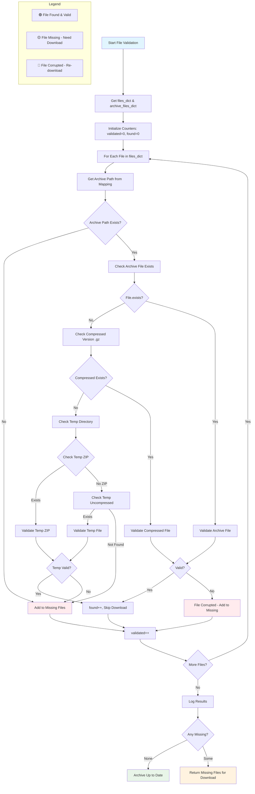

# Download Flow Documentation

This document details the complete download process for GPS receiver data, from CLI command to archived files.

## Main Download Flow

```mermaid
flowchart TD
    A[CLI Command: receivers download STATION] --> B[Parse Arguments]
    B --> C[Load Station Configuration]
    C --> D{Station Config Valid?}
    D -->|No| E[Exit with Error]
    D -->|Yes| F[ReceiverFactory.create()]

    F --> G{Detect Receiver Type}
    G -->|Leica| H[Create LeicaG10 Instance]
    G -->|NetR9| I[Create NetR9 Instance]
    G -->|NetRS| J[Create NetRS Instance]
    G -->|PolaRX5| K[Create PolaRX5 Instance]

    H --> L[Initialize FTP Downloader]
    I --> M[Initialize HTTP Downloader]
    J --> N[Initialize HTTP Downloader]
    K --> O[Initialize FTP/TCP Downloader]

    L --> P[Test Connection?]
    M --> P
    N --> P
    O --> P

    P -->|Yes| Q[Test FTP/HTTP Connection]
    P -->|No| R[Skip Connection Test]
    Q --> S{Connection OK?}
    S -->|No| E
    S -->|Yes| R

    R --> T[Call receiver.download_data()]

    T --> U[Generate File List]
    U --> V[Parse Session Parameters]
    V --> W[Build DateTime List using gtimes]
    W --> X[Generate Remote Paths]
    X --> Y[Generate Archive Paths]

    Y --> Z[Normalize Timestamps]
    Z -->|Daily 15s_24hr| AA[Set hour=0 midnight]
    Z -->|Hourly 1Hz_1hr| BB[Keep actual hour]
    AA --> CC[Create Archive Mapping]
    BB --> CC

    CC --> DD[Validate Existing Files]
    DD --> EE{Check Archive}
    EE -->|Exists & Valid| FF[Skip File - Add to Found List]
    EE -->|Missing/Invalid| GG[Add to Missing List]
    FF --> HH{More Files?}
    GG --> HH
    HH -->|Yes| EE
    HH -->|No| II{Missing Files?}

    II -->|None| JJ[Archive Up to Date - Exit]
    II -->|Some| KK[Download Missing Files]

    KK --> LL[For Each Missing File]
    LL --> MM{Protocol?}
    MM -->|FTP| NN[FTP Download with Progress]
    MM -->|HTTP| OO[HTTP Download with Progress]

    NN --> PP[Download to Temp Directory]
    OO --> PP
    PP --> QQ{Download Success?}
    QQ -->|No| RR[Retry with Backoff]
    RR --> QQ
    QQ -->|Yes| SS[Validate Downloaded File]

    SS --> TT{Valid?}
    TT -->|No| RR
    TT -->|Yes| UU[Process File]

    UU --> VV{ZIP File?}
    VV -->|Yes| WW[Unzip to .m00]
    VV -->|No| XX[Keep as Downloaded]
    WW --> XX

    XX --> YY[Archive File]
    YY --> ZZ[Compress to .gz]
    ZZ --> AAA[Move to Archive Directory]
    AAA --> BBB[Clean Temp Files]

    BBB --> CCC{More Files?}
    CCC -->|Yes| LL
    CCC -->|No| DDD[Log Summary & Exit]

    style A fill:#e1f5fe
    style E fill:#ffebee
    style JJ fill:#e8f5e8
    style DDD fill:#e8f5e8
```

**Diagram Source**: [diagrams/download-flow.mmd](diagrams/download-flow.mmd)

## File Validation Flow



**Diagram Source**: [diagrams/validation-flow.mmd](diagrams/validation-flow.mmd)

## Process Phases

### Phase 1: Initialization & Configuration

- **CLI Parsing**: Parse command-line arguments including station, time range, session type
- **Configuration Loading**: Load station-specific settings from `~/.config/gpsconfig/`
- **Receiver Detection**: Use factory pattern to create appropriate receiver instance
- **Connection Testing**: Optional connection verification before download

**Key Classes:**

- `receivers.cli.main.main()` - CLI entry point
- `receivers.base.receiver_factory.ReceiverFactory` - Receiver creation
- `receivers.config.receivers_config.ReceiversConfig` - Configuration management

### Phase 2: File List Generation

- **Session Parsing**: Extract frequency parameters (afrequency, ffrequency, gt_frequency)
- **DateTime Generation**: Use gtimes to generate timestamp lists based on -D parameter
- **Path Building**: Generate both remote and archive paths using unified templates
- **Timestamp Normalization**: Critical fix ensuring consistent archive naming

**Key Insight - Timestamp Normalization:**

```python
# Daily files (15s_24hr): Always normalize to midnight
if ffrequency == "24hr":
    adjusted_dt = dt.replace(hour=0, minute=0, second=0, microsecond=0)
else:
    # Hourly files: Use actual hour boundaries
    adjusted_dt = dt.replace(minute=0, second=0, microsecond=0)
```

This ensures archive files have consistent naming regardless of download time:

- ✅ `SKFC202509240000a.m00.gz` (correct - daily file at midnight)
- ❌ `SKFC202509241500a.m00.gz` (wrong - uses download time)

### Phase 3: Archive Validation

The validation system checks multiple locations for existing files:

1. **Primary Archive**: `./tmp/data/YYYY/mmm/STATION/SESSION/raw/`
2. **Compressed Archive**: Same location with `.gz` extension
3. **Temporary Files**: Check `/tmp/download/STATION/` for partial downloads
4. **File Integrity**: Validate file size and basic structure

**Validation Logic:**

- If archive file exists and is valid → Skip download
- If archive file is corrupted → Re-download
- If only temp file exists and valid → Skip download
- If no valid file found → Add to missing list

### Phase 4: Download Execution

- **Protocol Selection**: FTP for Leica/PolaRX5, HTTP for NetR9/NetRS
- **Progress Tracking**: Real-time download progress with speed/ETA
- **Retry Logic**: Exponential backoff for failed downloads
- **Connection Management**: Proper connection setup (binary mode, passive/active)

**Connection Settings by Receiver:**

- **Leica G10**: FTP port 2160, active mode, 90s connect timeout, 600s data timeout
- **NetR9/NetRS**: HTTP port 8060, 30s connect timeout, 120s stall timeout
- **PolaRX5**: FTP passive mode, standard timeouts

### Phase 5: File Processing & Archiving

- **ZIP Processing**: Leica files downloaded as `.m00.zip` → unzip to `.m00`
- **Validation**: Check file integrity after download
- **Compression**: Compress to `.gz` format for storage efficiency
- **Archive Storage**: Move to organized directory structure
- **Cleanup**: Remove temporary files

**File Naming Examples:**

- **Download**: `SKFC267a.m00.zip` (Leica, day-of-year format)
- **Temp**: `SKFC267a.m00` (after unzipping)
- **Archive**: `SKFC202509240000a.m00.gz` (standardized timestamp)

## Error Handling & Recovery

### Connection Failures

- **Retry Logic**: Up to 3 attempts with 10-second delays
- **Timeout Handling**: Separate timeouts for connection vs data transfer
- **Graceful Degradation**: Continue with remaining files if one fails

### File Corruption

- **Validation Checks**: Size verification and basic integrity tests
- **Re-download**: Corrupted files automatically re-downloaded
- **Resume Capability**: Partial downloads can be resumed (protocol-dependent)

### Configuration Issues

- **Station Not Found**: Clear error messages with available stations
- **Invalid Session**: Validation of supported session types per receiver
- **Missing Credentials**: Proper error handling for authentication failures

## Performance Optimizations

### Efficient Validation

- **Archive Mapping**: Pre-compute filename → archive path mapping
- **Batch Operations**: Process multiple files in single operations where possible
- **Smart Skipping**: Skip validation for files known to exist

### Network Efficiency

- **Connection Reuse**: Maintain connections across multiple file downloads
- **Progress Monitoring**: Only download truly missing files
- **Parallel Processing**: Future enhancement for concurrent downloads

### Storage Management

- **Immediate Archiving**: Files archived immediately after download (fault tolerance)
- **Compression**: Automatic .gz compression reduces storage by ~70%
- **Directory Organization**: Year/month structure for efficient navigation

## Monitoring & Logging

### Success Metrics

- Files validated, found, downloaded
- Download speeds and durations
- Archive storage efficiency

### Error Tracking

- Connection failures with retry counts
- File corruption detection
- Configuration validation errors

### Audit Trail

- All download operations logged with timestamps
- Archive operations tracked for data integrity
- Performance metrics for system monitoring

This comprehensive flow ensures reliable, efficient GPS data collection across Iceland's diverse receiver network while maintaining data integrity and operational consistency.

