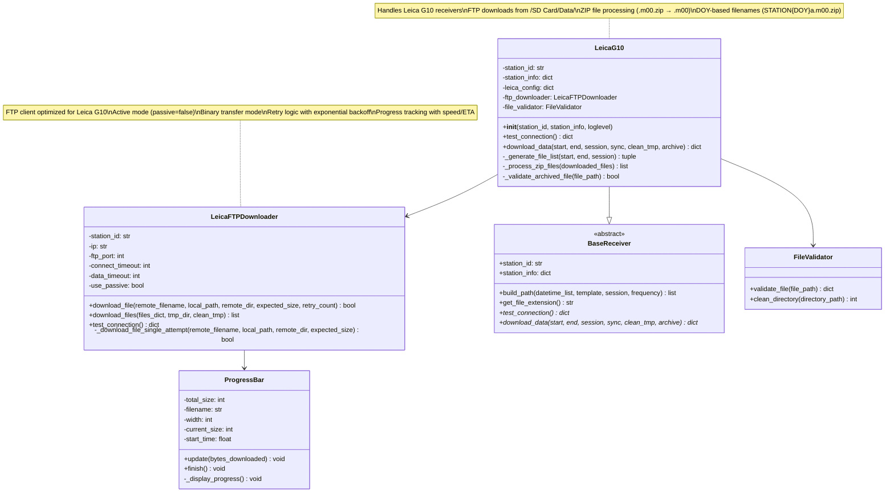
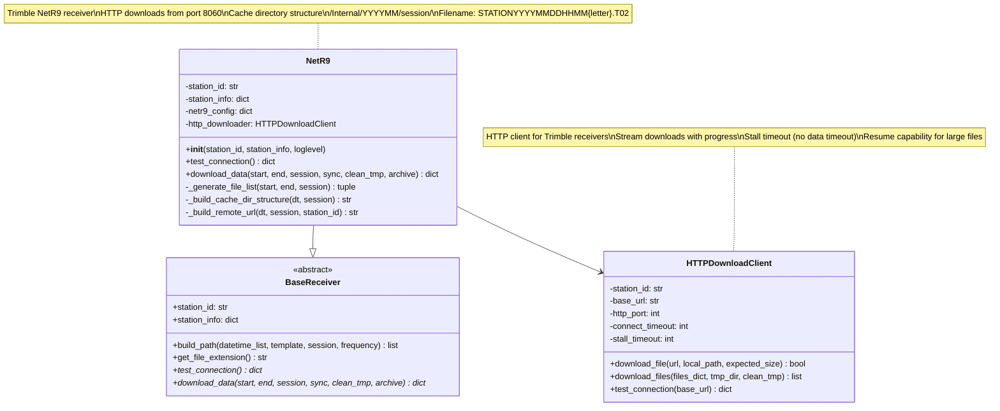
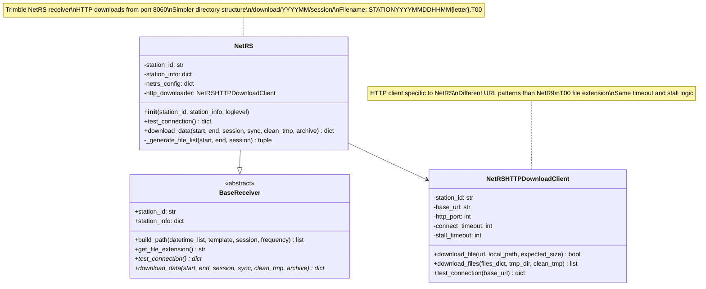

# Individual Receiver Types Guide

This document provides detailed implementation guide for each supported GPS receiver type, including class structures, protocols, and specific configuration requirements.

## Leica G10 Receiver

The Leica G10 implementation handles GPS receivers manufactured by Leica Geosystems, using FTP-based file downloads.



**Diagram Source**: [diagrams/leica-g10.mmd](diagrams/leica-g10.mmd)

### Leica G10 Implementation Details

**File Path**: `src/receivers/leica/g10.py`

#### Key Characteristics
- **Protocol**: FTP (Anonymous login)
- **Port**: 2160 (non-standard)
- **Connection Mode**: Active (passive=false) - Critical for data transfer success
- **File Format**: ZIP compressed (.m00.zip → .m00 → .m00.gz)
- **Directory Structure**: Flat structure directly under session directories

#### Session Support
- **15s_24hr**: Daily files in `/SD Card/Data/15s_24hr/`
- **1Hz_1hr**: Hourly files in `/SD Card/Data/1s_1hr/STATION/YYYY/MM/DD/`
- **status_1hr**: Status files (future implementation)

#### Unique Features
- **ZIP Processing**: Only receiver type that downloads compressed files
- **DOY Filenames**: Uses day-of-year format (267a.m00.zip for Sept 24)
- **Active FTP**: Requires active mode for data connections
- **Binary Mode**: Explicit binary mode setting prevents corruption

#### Critical Configuration
```ini
[leica]
ftp_port = 2160
ftp_passive = false
ftp_timeout_connect = 90
ftp_timeout_data = 600
```

## NetR9 Receiver

Trimble NetR9 receivers use HTTP-based downloads with a cache directory structure.



**Diagram Source**: [diagrams/netr9.mmd](diagrams/netr9.mmd)

### NetR9 Implementation Details

**File Path**: `src/receivers/trimble/netr9.py`

#### Key Characteristics
- **Protocol**: HTTP
- **Port**: 8060
- **File Format**: Raw T02 files (no compression)
- **Directory Structure**: Nested cache directory structure
- **URL Pattern**: `http://station.domain:8060/CACHEDIR.../download/Internal/YYYYMM/session/`

#### Session Support
- **15s_24hr**: Daily files with 'a' suffix
- **1Hz_1hr**: Hourly files with 'b' suffix
- **status_1hr**: Status files with 'c' suffix

#### Unique Features
- **Cache Directory**: Complex nested directory structure for organization
- **Stream Downloads**: HTTP streaming for large files
- **Stall Timeout**: Progress-based timeout (120s without data)

## NetRS Receiver

Trimble NetRS receivers use a simpler HTTP-based approach compared to NetR9.



**Diagram Source**: [diagrams/netrs.mmd](diagrams/netrs.mmd)

### NetRS Implementation Details

**File Path**: `src/receivers/trimble/netrs.py`

#### Key Characteristics
- **Protocol**: HTTP
- **Port**: 8060
- **File Format**: Raw T00 files (no compression)
- **Directory Structure**: Simple `/download/YYYYMM/session/` pattern
- **File Extension**: .T00 (vs .T02 for NetR9)

#### Session Support
- **15s_24hr**: Daily files in `/download/YYYYMM/a/`
- **1Hz_1hr**: Hourly files in `/download/YYYYMM/b/`
- **status_1hr**: Status files in `/download/YYYYMM/c/`

#### Differences from NetR9
- **Simpler URLs**: No cache directory complexity
- **T00 Extension**: Different file extension
- **Directory Mapping**: Session letters map directly to directories

## Unified Architecture Features

### Common Base Class
All receivers inherit from `BaseReceiver` which provides:
- **Unified Path Generation**: `build_path()` method using gtimes templates
- **Configuration Management**: Consistent config loading
- **Session Parameter Parsing**: Standardized session handling
- **Archive Template Support**: Common archiving patterns

### Timestamp Normalization
**Critical Feature**: All receivers now use consistent timestamp normalization:

```python
# Daily files (15s_24hr): Always normalize to midnight
if ffrequency == "24hr":
    adjusted_dt = dt.replace(hour=0, minute=0, second=0, microsecond=0)
else:
    # Hourly files: Use actual hour boundaries
    adjusted_dt = dt.replace(minute=0, second=0, microsecond=0)
```

This ensures consistent archive naming:
- Daily files: `STATION202509240000a.ext.gz`
- Hourly files: `STATION202509241500b.ext.gz`

### Error Handling & Reliability

#### Connection Management
- **Timeout Handling**: Separate connect and data timeouts
- **Retry Logic**: Exponential backoff for failed operations
- **Protocol-Specific**: Optimized for each receiver's characteristics

#### File Validation
- **Integrity Checks**: Size and basic structure validation
- **Archive Mapping**: Efficient filename to archive path mapping
- **Resume Capability**: Handle partial downloads gracefully

#### Progress Monitoring
- **Real-time Progress**: Speed, ETA, and percentage completion
- **Stall Detection**: Different strategies per protocol
- **User Feedback**: Clear indication of download status

### Configuration Management

Each receiver type has specific configuration in `~/.config/gpsconfig/receivers.cfg`:

```ini
[leica]
protocol = ftp
ftp_port = 2160
ftp_passive = false
# ... other Leica-specific settings

[netr9]
protocol = http
http_port = 8060
# ... other NetR9-specific settings

[netrs]
protocol = http
http_port = 8060
# ... other NetRS-specific settings
```

This modular approach allows easy addition of new receiver types while maintaining operational consistency across Iceland's diverse GPS receiver network.

## Troubleshooting by Receiver Type

### Leica G10 Common Issues
- **Connection Refused**: Check `ftp_passive = false` setting
- **File Corruption**: Ensure binary mode is enabled
- **Slow Downloads**: Increase `ftp_timeout_data` setting
- **ZIP Errors**: Verify file integrity after download

### NetR9/NetRS Common Issues
- **HTTP 404 Errors**: Verify URL patterns and cache directory structure
- **Stall Timeouts**: Increase `http_stall_timeout` for slow connections
- **File Not Found**: Check session directory mapping
- **Large File Issues**: Monitor progress-based timeout behavior

### Configuration Debugging
```bash
# Test specific receiver type
receivers download STATION --test-connection -v

# Check configuration loading
receivers validate STATION --verbose

# Monitor download progress
receivers download STATION -D 1 --sync -v
```